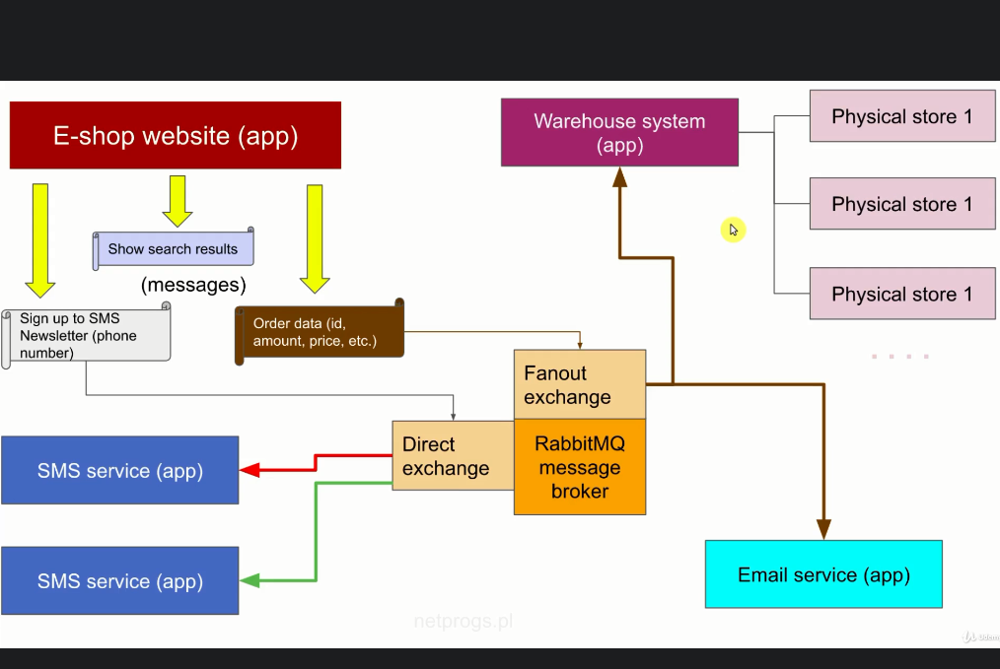

# Message brokers

    Delegates actions to another application with async capability
    that means the system don't need to wait any action finish to
    start another one, because we don't execute the action in the same time.
    
    The message component send the action to RabbiMQ that spool the action
    inside a AMPQ server that, delegate where and to whose send the action
    it can be in the same system or in another system.

    Any example is, a customer buy something inside a e-commerce
    and our system needs to update the warehouse of the store
    to don't freeze the user in a windows until this action
    is completed we send any action async to another system
    in the same time we are completing the shopping we are
    updating the database of the warehouse.

###### Symfony message component diagram

##### A flow of message inside symfony simulating a e-shop

##### RabbitMQ actions delegate flow

# CQRS

    Is a design that needs to be implemented when working with message brokers
    the goal here is segregate the action of the message.
        
    A message component should have:
        - Query: only retrieve some information
        - Command: do something like connect to some API or save something inside database
        - Handler do all business logic

    A message is like a event, that need to be dispatched by a broker.

## Symfony Messenger

    Provide methods to dispatch envelopes

    1. install the component
    2. edit .env
    3. edit messenger.yaml
    4. edit services.yaml
    5. create the handlers and assign them inside messenger as async
    6. php bin/console messenger:consume -vv (Execute messages if with doctrine transport)

#### Methods

    - MessageBusInterface inside controller
    - $this->messageBus->dispatch(new SignUpSms($phoneNumber));
    - $this->handler(new SignUpSms($phoneNumber)); (use HandlerTrait)
    - public function __invoke(SignUpSms $signUpSms)

## RabbitMQ

    Is a AMPQ server that handle messages and send to different applications

    1. uncomment the entry inside .env
    2. create the transport at messenger.yaml
    
    at this point let's imagine that needs to send to another microservice
    Needs to configure like the first project
        - configure the .env
        - configure the service.yaml
        - configure the messenger.yaml
        - create the ques inside RabbitMQ or symfony will do
        - bind the ques
        - inside the microservice that you send the action needs to have the command you want to execute

    

##### Installation

    - check: https://dev.to/rezende79/how-to-install-amqp-extension-for-php-7-4-on-windows-10-108d
    - after access: http://localhost:15672/#/