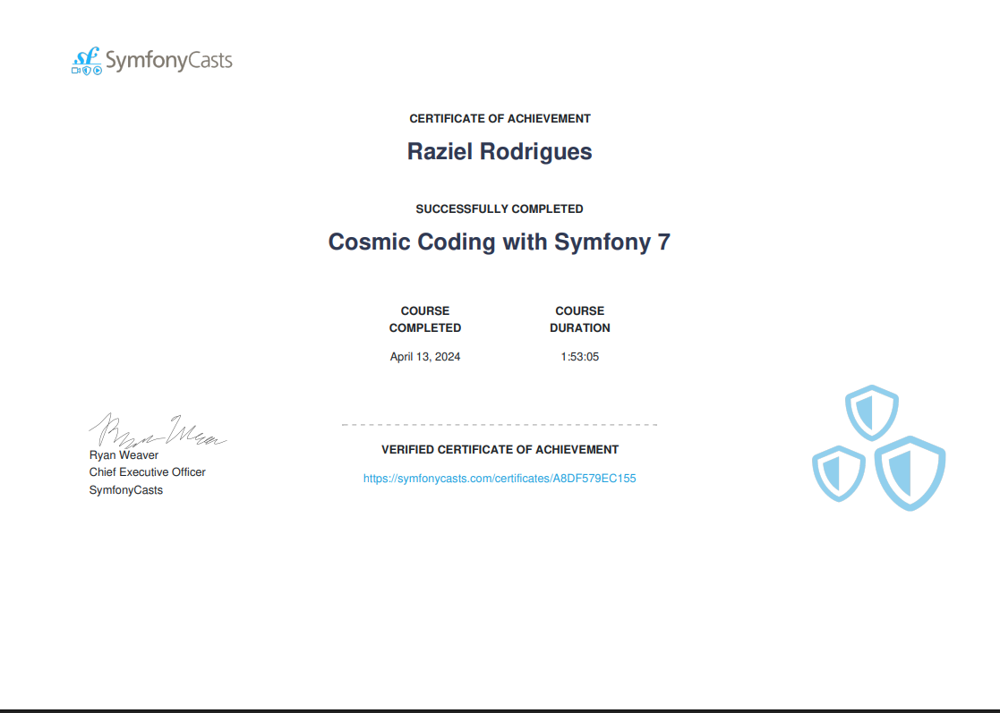
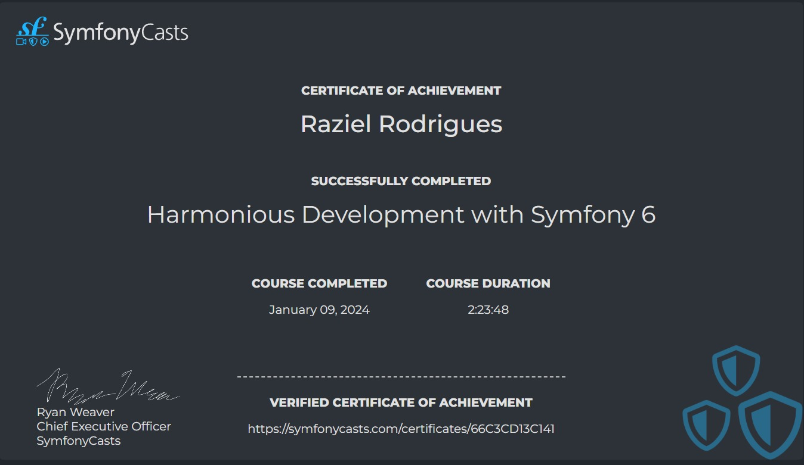
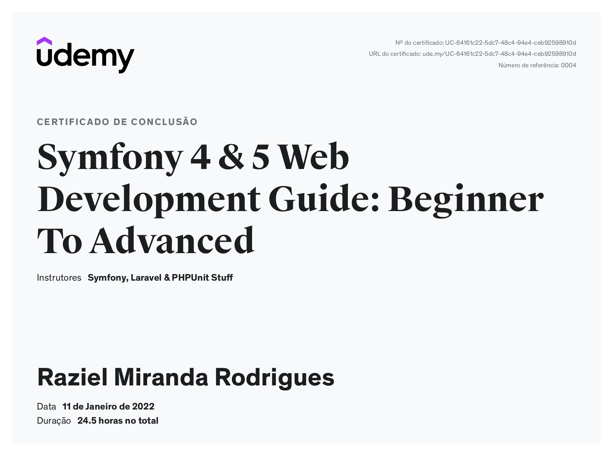

# SYMFONY 7 COSMIC

This repository hold my way through symfony 6 course by SymfonyCast.

# GETTING STARTED

docker compose up -d or Symfony server:start

# TECH STACK

- php 8.2
- apache
- mysql
- composer
- Symfony cli
- Symfony 7

https://symfonycasts.com/u/razielrodrigues/badges/133

# SYMFONY 6 HARMONIUS

This repository hold my way through symfony 6 course by SymfonyCast.

# GETTING STARTED

docker compose up -d or Symfony server:start

# TECH STACK

- php 8.2
- apache
- mysql
- composer
- Symfony cli
- Symfony 7

https://symfonycasts.com/u/razielrodrigues/badges/133

# SYMFONY 6 HANDS ON

In this course I learned a lot about PHP 8 and Symfony 6 teacher brought fresh knowledge about the framework and the language, some cool features we did:

    - A lot of CRUD operations
    - Basic Authentication
    - Docker environment
    - Sending emails
    - Doctrine database relationships
    - Voter
    - Eager/lazy loading
    - Service containers
    - Post, like, follow, comment and extra privacy features

# FOR THE FUTURE

Now I'm planning to implement more features inside this project they were:

    - Auth 2 with google
    - Integration with pay syste,
    - Cover with unit tests
    - Deploy app
    - Change some frontend for my pourpouses

# SYMFONY 5 HANDS ON

"Symfony is a widely used php web framework is a very interest and powerful"

# Checkout my projects

    - checkout symfony-to-do-app
    - checkout symfony-video-social-network-app
    - checkout symfony-api-platform-app
    - checkout symfony-message-broker-app
    - checkout symfony-4-video-app

## Symfony Core Features

    composer create-project symfony/skeleton my_project_name

    composer require symfony/apache-pack
    composer require symfony/maker-bundle --dev
    composer require doctrine/annotations
    composer require twig

    php -S 127.0.0.1:8000 -t public

## Routes

    Handle requests, can be defined by php, annotations or yaml file

#### Methods

    /**
    * @Route("/blog/{page?}", name="blog_list", methods={POST})
    */
    public function index2()
    {
        return new Response('Optional parameters in url and 
        requirements for parameters');
    }

    /**
    * @Route("/blog/{page?}", name="blog_list", methods={GET})
    */
    public function index2()
    {
        return new Response('Optional parameters in url and 
        requirements for parameters');
    }

    /**
    * @Route("/blog/{page?}", name="blog_list", requirements={"page"="\d+"})
    */
    public function index2()
    {
        return new Response('Optional parameters in url and 
        requirements for parameters');
    }

    /**
    * @Route(
    *      "/articles/{_locale}/{year}/{slug}/{category}",
    *      defaults={"category": "computers"},
    *      requirements={
    *         "_locale": "en|fr", 
    *          "category": "computers|rtv",
    *          "year": "\d+"
    *      }    
    * )
    */
    public function index3()
    {
        return new Response('An advanced route example');
    }

    /**
    * @Route({
    *      "nl": "/over-ons",
    *       "en": "/about-us"
    * }, name="about_us")
    */
    public function index4()
    {
        return new Response('Translated routes');
    }

## Controllers

    php bin/console make:controller ControllerName

#### Methods

    //? Return to a page with parameter to access from twig
    return $this->render('default/index.html.twig', ['controller_name' => 'DefaultController',]);

    //? Return a json string
    // return $this->json(['controller_name' => 'DefaultController',]);
    
    The message component send the action to RabbiMQ that spool the action
    inside a AMPQ server that, delegate where and to whose send the action
    it can be in the same system or in another system.

    Any example is, a customer buy something inside a e-commerce
    and our system needs to update the warehouse of the store
    to don't freeze the user in a windows until this action
    is completed we send any action async to another system
    in the same time we are completing the shopping we are
    updating the database of the warehouse.

###### Symfony message component diagram

##### A flow of message inside symfony simulating a e-shop

##### RabbitMQ actions delegate flow

# CQRS

    Is a design that needs to be implemented when working with message brokers
    the goal here is segregate the action of the message.
        
    A message component should have:
        - Query: only retrieve some information
        - Command: do something like connect to some API or save something inside database
        - Handler do all business logic

    A message is like a event, that need to be dispatched by a broker.

## Symfony Messenger

    Provide methods to dispatch envelopes

    1. install the component
    2. edit .env
    3. edit messenger.yaml
    4. edit services.yaml
    5. create the handlers and assign them inside messenger as async
    6. php bin/console messenger:consume -vv (Execute messages if with doctrine transport)

#### Methods

    - MessageBusInterface inside controller
    - $this->messageBus->dispatch(new SignUpSms($phoneNumber));
    - $this->handler(new SignUpSms($phoneNumber)); (use HandlerTrait)
    - public function __invoke(SignUpSms $signUpSms)

## RabbitMQ

    Is a AMPQ server that handle messages and send to different applications

    1. uncomment the entry inside .env
    2. create the transport at messenger.yaml
    
    at this point let's imagine that needs to send to another microservice
    Needs to configure like the first project
        - configure the .env
        - configure the service.yaml
        - configure the messenger.yaml
        - create the ques inside RabbitMQ or symfony will do
        - bind the ques
        - inside the microservice that you send the action needs to have the command you want to execute

##### Installation

    - check: https://dev.to/rezende79/how-to-install-amqp-extension-for-php-7-4-on-windows-10-108d
    - after access: http://localhost:15672/#/

# Symfony Core Features

    composer create-project symfony/skeleton my_project_name

    composer require symfony/apache-pack
    composer require symfony/maker-bundle --dev
    composer require doctrine/annotations
    composer require twig

    php -S 127.0.0.1:8000 -t public

## Routes

    Handle requests, can be defined by php, annotations or yaml file

#### Methods

    /**
    * @Route("/blog/{page?}", name="blog_list", requirements={"page"="\d+"})
    */
    public function index2()
    {
        return new Response('Optional parameters in url and 
        requirements for parameters');
    }

    /**
    * @Route(
    *      "/articles/{_locale}/{year}/{slug}/{category}",
    *      defaults={"category": "computers"},
    *      requirements={
    *         "_locale": "en|fr", 
    *          "category": "computers|rtv",
    *          "year": "\d+"
    *      }    
    * )
    */
    public function index3()
    {
        return new Response('An advanced route example');
    }

    /**
    * @Route({
    *      "nl": "/over-ons",
    *       "en": "/about-us"
    * }, name="about_us")
    */
    public function index4()
    {
        return new Response('Translated routes');
    }

## Controllers

    php bin/console make:controller ControllerName

#### Methods

    //? Return to a page with parameter to access from twig
    return $this->render('default/index.html.twig', ['controller_name' => 'DefaultController',]);

    //? Return a json string
    // return $this->json(['controller_name' => 'DefaultController',]);
    
    //? Redirect to a link
    // return $this->redirect('google.com');

    //? Redirect to a  Route with or not parameters
    // return $this->redirectToRoute('default2');

    //? Create a new response object
    return new Response('from controller default 1');

    //? Redirect to another page
    return forward('default1');

## Views

    Display html file

#### Methods

    tags, filters, functions tests and operators

    generate URL and escape string

    global variables

    webpack encore

    app variable

## Entities

    composer require doctrine

    -- After config .env
    php bin/console doctrine:database:create

    php bin/console make:entity EntityName

    php bin/console make:migrations

    php bin/console doctrine:migrations:migrate

#### Methods

    Lazy loading: when you get all data like findAll()
    Eager loading: when you create a method inside entity and return specific data
    
    one to one relationship
        - relation in the field of new entity
        - choose the table that references
        - to remove all when delete: cascade = remove or orphanRemove = true
    
    polymorphic queries returns a various type of object
        - create a abstract class ex: file 
            - video and pdf class extends file
        - remove get and set id method from child classes
        - have some ORM rules to be put inside abstract class
            /**
            * @ORM\InheritanceType("JOINED") // Create a table for each class
            * @ORM\InheritanceType("SINGLE_TABLE") // One table for all class
            * @ORM\DiscriminatorColumn(name="type", type="string") // The column that have the object type
            * @ORM\DiscriminatorMap({"video"="Video" , "pdf"="Pdf"}) // Link with the class
            */

## Services

    Classes that do something useful

#### Methods

    - auto wire
        - automatic configure the service in the container interface

    - @required
        - this annotation transform a normal method like a construct can use with traits to do optional constructs for my classes

    - lazy load services options
        - create a instance only if the method that use the service is called
        - requires a proxy-bridge-package
    
    - tags
        - you can add a listener inside your service to execute some method when a action occurs ex: flush doctrine
    
    - parameters
        - can be set default parameters at service.yaml

    - aliases
        - you can create aliases to the services

    - service interface
        - can change service.yaml file

## Cache

    composer require symfony/cache

#### Methods
    
        - create a cache and delete it also can add expire time
            $cache = new FilesystemAdapter();
            $posts_from_db = ['post 1', 'post 2', 'post 3']
            $posts->set(serialize($posts_from_db));
            $posts->expiresAfter(5);
            $posts = $cache->getItem('database.get_posts');
            $cache->deleteItem('database.get_posts');
            $cache->clear();
            dump(unserialize($posts->get()));
        
        - create cache with tags
            $cache = new TagAwareAdapter(
                new FilesystemAdapter()
            );
            $acer = $cache->getItem('acer');
            if (!$acer->isHit())
            {
                $acer_from_db = 'acer laptop';
                $acer->set($acer_from_db);
                $acer->tag(['computers','laptops','acer']);
                $cache->save($acer);
            }
            $cache->invalidateTags(['computers']);
            dump($acer->get());

## Events e listeners
    
    Listen to an action in the system and do something after or before it
    * events you need to specify inside service.yaml not best way
        # App\Listeners\VideoCreatedListener:
        #     tags:
        #         - { name: kernel.event_listener, event: video.created.event, method: onVideoCreatedEvent }
    * subscriber not because always know which events is listening

#### Methods

    - Create a listener class inside listener folder this class holds the methods you want to execute

        namespace App\Listeners;
        class VideoCreatedListener  {
            public function onVideoCreatedEvent($event)
            {
                //some entity property
                dump($event->video->title);
            }
        }

    - Create a event class inside events folder (if aren't using event subscribers)

        namespace App\Events;
        use Symfony\Component\EventDispatcher\Event;
        class VideoCreatedEvent extends Event {
            public function __construct($video)
            {
                $this->video = $video;
            }
        }
    
    - debug with debug:event-dispatcher video.created.event

    - call inside the controller

        public function __construct(EventDispatcherInterface $dispatcher)
        {
            $this->dispatcher = $dispatcher;
        }

        public function index(Request $request)
        {
            $video = new \stdClass();
            $video->title = 'Funny movie';
            $video->category = 'funny';
            //When create a new video show the title of the video
            $event = new VideoCreatedEvent($video);
            $this->dispatcher->dispatch('video.created.event', $event);
        }  
            

    - php bin/console make:subscriber

    class VideoCreatedSubscriber implements EventSubscriberInterface
    {
        //The method you want to execute
        public function onVideoCreatedEvent($event)
        {
            dump($event->video->title);
        }

        //other method
        public function onKernelResponse(FilterResponseEvent $event)
        {
            $response = new Response('dupa');
            // $event->setResponse($response);
        }

        public static function getSubscribedEvents()
        {
            //name to call inside controller
            return [
            'video.created.event' => 'onVideoCreatedEvent',
            KernelEvents::RESPONSE => 'onKernelResponse',
            ];
        }
    }

## Forms

    Create forms based in entities

    php bin/console make:form entityName

#### Methods

    - customize form class

    - add themes inside twig.yaml
        form_themes: ['bootstrap_4_layout.html.twig']
        
    - also can define inside twig files
        

    - call with {{ form(form) }} inside twig template
        {{ form_start(form) }}
            {{ form_label(form) }}
            {{ form_widget(form) }}
            {{ form_widget(form.title) }} // can access specific properties
        {{ form_end(form) }}

    - call inside controller

        $entityManager = $this->getDoctrine()->getManager();
        // $videos = $entityManager->getRepository(Video::class)->findAll();
        // dump($videos);
        // $video = new Video();
        // $video->setTitle('Write a blog post');
        // $video->setCreatedAt(new \DateTime('tomorrow'));
        $video = $entityManager->getRepository(Video::class)->find(1);

        $form = $this->createForm(VideoFormType::class, $video);
        $form->handleRequest($request);
        if ($form->isSubmitted() && $form->isValid())
        {
            $entityManager->persist($video);
            $entityManager->flush();
            return $this->redirectToRoute('home');
        }

        return $this->render('default/index.html.twig', [
            'controller_name' => 'DefaultController',
            'form' => $form->createView(),
        ]);

    - validations

        composer require symfony/validator doctrine/annotations
        - set the annotation inside entity

            // @Assert\Email(message = "The email '{{ value }}' is not a valid email.")
            /**
            * @ORM\Column(type="string", length=255)
            * @Assert\NotBlank()
            * @Assert\Length(min = 2, max = 10, minMessage = "Video title must be at least {{ limit }} characters long", maxMessage = "Video title cannot be longer than {{ limit }} characters")
            */
            private $title;
    
    - events
        * create an event inside form class

            $builder->addEventListener(FormEvents::PRE_SET_DATA, function(FormEvent $event){

                $video = $event->getData();
                $form = $event->getForm();
                if (!$video || null === $video->getId())
                {
                    $form->add('created_at', DateType::class, [
                        'label' => 'Set date',
                        'widget' => 'single_text',
                    ]);
                }

            });

    - upload files
        - set file annotations inside entity class
        - add file type inside form class
        - $form->file->get("file")->getData()

    - add mapped => false to don't map the form field from the entity

## Emails

    composer require symfony/swiftmailler-bundle
        * need to configure

        - spool don't send the email instantantly
            swiftmailer:
            url: '%env(MAILER_URL)%'
            spool:
                type: file
                path: '%kernel.project_dir%/var/spool'

        - Mailer URL

#### Methods

    - create a twig file to be the email template
    - call inside controller

        $message = (new \Swift_Message('Hello Email'))
        ->setFrom('send@example.com')
        ->setTo('recipient@example.com')
        ->setBody(
            $this->renderView(
                'emails/registration.html.twig',
                array('name' => 'Robert')
            ),
            'text/html'
        );
        $mailer->send($message);

    - test email

        php bin/console make:functional-test

        $client = static::createClient();
        $client->enableProfiler();
        $crawler = $client->request('GET', '/home');

        $mailCollector = $client->getProfile()->getCollector('swiftmailer');
        $this->assertSame(1, $mailCollector->getMessageCount());

        $collectedMessages = $mailCollector->getMessages();
        $message = $collectedMessages[0];

        $this->assertInstanceOf('Swift_Message', $message);
        $this->assertSame('Hello Email', $message->getSubject());
        $this->assertSame('send@example.com', key($message->getFrom()));
        $this->assertSame('recipient@example.com', key($message->getTo()));
        $this->assertContains('You did it! You registered!', $message->getBody());

## Security

    Used to set security inside project specially when is about login

    composer require security

#### Methods

    - create a user entity
    - create registration form
    - create login form
    - create routes
    - CSRF token

    - security.yaml (extra configs)

        firewalls:
            dev:
                pattern: ^/(_(profiler|wdt)|css|images|js)/
                security: false
            main:
                anonymous: true

                # activate different ways to authenticate

                # http_basic: true
                # https://symfony.com/doc/current/security.html#a-configuring-how-your-users-will-authenticate

                form_login:
                    login_path: login
                    check_path: login
                # https://symfony.com/doc/current/security/form_login_setup.html
            # csrf_token_generator: security.csrf.token_manager
                    username_parameter: 'email'
                    password_parameter: 'password'
                    csrf_token_generator: security.csrf.token_manager

                logout:
                    path:   /logout
                    target: /home

                remember_me:
                    secret: '%kernel.secret%'
                    lifetime: 604800 # 1 week in seconds
                    #always_remember_me: true
                    path: /

    - security authorization with annotation
        /**
        * needs to add expression languages pack
        * @Route("/home/{id}/delete-video", name="home")
        * @Security("user.getId() == video.getSecurityUser().getId()") // only the owner of can do the action
        * or
        * @Security("has_role('ROLE_ADMIN')") // only admin can do the action
        */

    - security authorization with denyAccess Method
        $this->denyAccessUnlessGranted('IS_AUTHENTICATED_FULLY');

    - security authorization inside view
        if is_granted()

    - security authorization with voter
        create voter class
        call inside controller $this->denyAccessUnlessGranted();

## Tests

    - Unit tests is to test functions and result of those
        - composer require symfony/phpunit-bridge

    - Function tests is to test the functionality of a page
        - composer require symfony/test-pack

    - run the tests with ./bin/phpunit

    - code coverage

#### Methods

    - create the unit test with make
        // Example function
        public function testSomething()
        {
            $calculator = new Calculator();
            $result = $calculator->add(1,9);
            $this->assertEquals(10,$result);
        }

    - create the functional test with make
    - can use provide URL (do a test in a lot of url)
    - test with database
        - option 1: set a specific database to test
        - option 2: use transaction

    - example function test class
        namespace App\Tests;

        use Symfony\Bundle\FrameworkBundle\Test\WebTestCase;
        use App\Entity\Video;

        class DefaultControllerTest extends WebTestCase
        {

            private $entityManager;

            protected function setUp()
            {
                parent::setUp();
                $this->client = static::createClient();

                $this->entityManager = $this->client->getContainer()->get('doctrine.orm.entity_manager');

                $this->entityManager->beginTransaction();
                $this->entityManager->getConnection()->setAutoCommit(false);
            }

            protected function tearDown()
            {
                $this->entityManager->rollback();
                $this->entityManager->close();
                $this->entityManager = null;
            }

            /**
            * @dataProvider provideUrls
            */
            public function testSomething($url)
            {
                $crawler = $this->client->request('GET', $url);
                $this->assertTrue($this->client->getResponse()->isSuccessful());

                $video = $this->entityManager
                    ->getRepository(Video::class)
                    ->find(1);

                $this->entityManager->remove($video);
                $this->entityManager->flush();

                $this->assertNull($this->entityManager
                ->getRepository(Video::class)
                ->find(1));
        
            }

            public function provideUrls()
            {
                return [
                    ['/home'],
                    ['/login']
                ];
            }
        }

## Others topics

    - flash messages
    - cookies
    - session
    - post e get data
    - custom error pages
    - handle exceptions
    - LDAP
    - voters
    - Web Link
    - Web assets
    - Webpack encore
    - bundles
    - locks
    - workflow
    - strings / unicode
    - UID / UUID
    - parser
    - serialization
    - notifications
    
