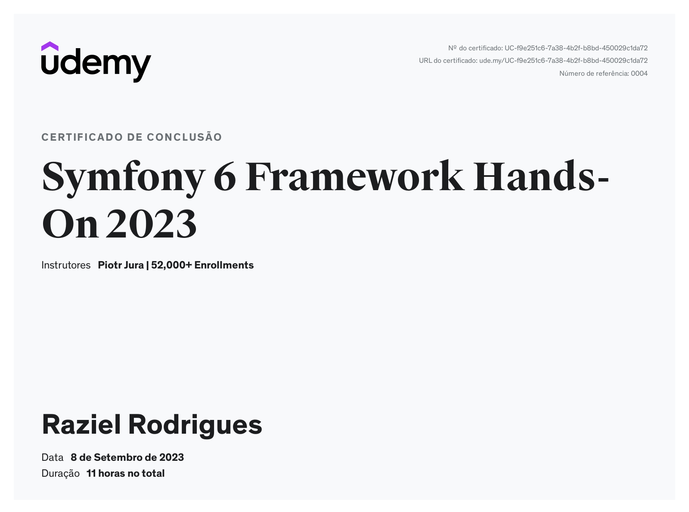

# SYMFONY 6 HANDS ON

In this course I learned a lot about PHP 8 and Symfony 6 teacher brought fresh knowledge about the framework and the language, some cool features we did:

    - A lot of CRUD operations
    - Basic Authentication
    - Docker environment
    - Sending emails
    - Doctrine database relationships
    - Voter
    - Eager/lazy loading
    - Service containers
    - Post, like, follow, comment and extra privacy features

# FOR THE FUTURE

Now I'm planning to implement more features inside this project they were:

    - Auth 2 with google
    - Integration with pay syste,
    - Cover with unit tests
    - Deploy app
    - Change some frontend for my pourpouses

